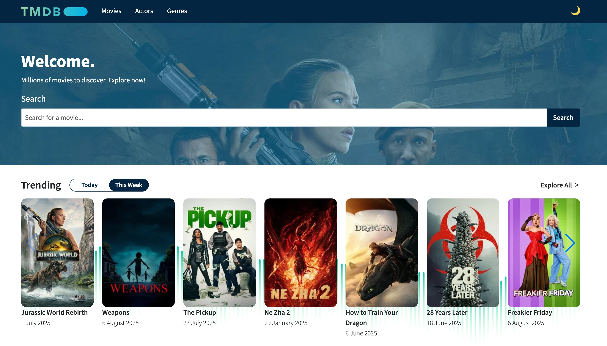

# CINE PULSE


**Cine Pulse** is a React + TypeScript clone of [The Movie Database (TMDB)](https://www.themoviedb.org/) website.  
Users can browse, search, and explore movies using TMDb's public API.

## Preview



**Live Demo:** [cine-pulse.netlify.app/](https://cine-pulse.netlify.app/)

## Features

-   Browse popular and trending movies
-   Search by title
-   Light/dark mode toggle
-   Responsive design
-   Data caching and fetching with React Query

## Installation

To set up this project locally, run the following commands:

```bash
git clone https://github.com/leozarazaga/the-movie-database.git
cd the-movie-database
npm install
```

## Environment Variables

You will need an API key from [TMDb](https://www.themoviedb.org/documentation/api) to run the app.

1. Create a `.env` file in the project root.
2. Add your API key:

```env
VITE_TMDB_BEARER_TOKEN=your_tmdb_api_key_here
```

##### If you don’t set this, running the app will fail with an error ⚠️

## Running the Project

Start the development server with:

```bash
npm run dev
```

## Quality Checks

Run linting, type checking, and type coverage with:

```bash
npm run check
```

This runs:

-   ESLint
-   TypeScript strict checks
-   Type coverage (requires 100%)

## Technologies Used

-   **React 19 + TypeScript** – Component-based UI with strong typing
-   **Vite** – Fast development server and build tool
-   **React Router** – Client-side routing
-   **Axios** – HTTP client for API requests
-   **React Query** – Data fetching and caching
-   **Swiper.js** – Touch-enabled carousels
-   **Bootstrap + React Bootstrap** – UI components and styling
-   **ESLint + Type Coverage** – Code quality and type safety

## Contributing

Contributions are welcome! To contribute:

1. Fork the repo
2. Create a feature branch (`git checkout -b feature/my-feature`)
3. Commit your changes (`git commit -m 'Add new feature'`)
4. Push the branch (`git push origin feature/my-feature`)
5. Open a pull request

## License

This project is licensed under the [MIT License](./LICENSE).

You are free to use, modify, and distribute this software, provided the original copyright and permission notices are included.

**Disclaimer:** This project is a personal clone of [The Movie Database (TMDB)](https://www.themoviedb.org/) and uses their public API for demonstration and learning purposes. Please refer to TMDb’s [API Terms of Use](https://www.themoviedb.org/documentation/api/terms-of-use) for restrictions.
